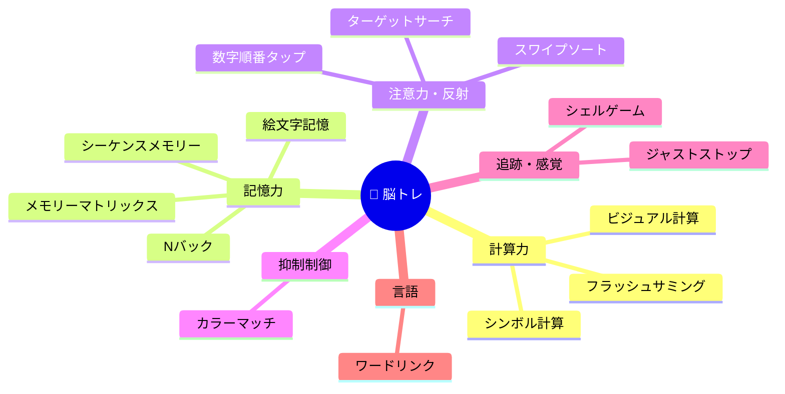

# 🧠 脳トレアプリ ゲーム評価レポート

## 総合評価: ⭐⭐⭐⭐ (4/5)

14種類の脳トレゲームを、**デザイン**・**ゲームメカニクス**・**認知トレーニング効果**・**コード品質**の観点から評価しました。

---

## 📊 サマリー

| カテゴリ | 評価 | コメント |
|---------|------|---------|
| **デザイン/UX** | ⭐⭐⭐⭐⭐ | グラスモーフィズム＋ダークテーマで統一された美しいUI |
| **ゲームバラエティ** | ⭐⭐⭐⭐⭐ | 認知機能を幅広くカバーする充実した14種類 |
| **ゲームプレイ品質** | ⭐⭐⭐⭐ | 各ゲームとも基本的に完成度が高い |
| **コード品質** | ⭐⭐⭐ | 動作するが、構造面でいくつか改善余地あり |
| **アクセシビリティ** | ⭐⭐ | キーボード対応が一部に限られる |

---

## 🎮 ゲーム個別評価

### 1. ビジュアル計算 🔵 — ⭐⭐⭐⭐⭐

- **鍛える力**: 数量認識・暗算
- **優れた点**: 大・中・小の丸で数を視覚的に表現する独自性が光る。加算・減算・乗算・カウントの4パターンで飽きにくい。難易度に応じたタイマーも適切
- **キーボード対応**: ✅ あり

### 2. 数字順番タップ 🔢 — ⭐⭐⭐⭐

- **鍛える力**: 視覚探索・反射速度
- **優れた点**: ラウンドごとに10〜20の数字をランダム生成し、マンネリ化を防止。位置被りの衝突チェックも実装済み
- **改善点**: 数の上限が20でやや天井が低い。ラウンド数に応じて上限を上げると長期的なやりがいが増す

### 3. メモリーマトリックス 🧩 — ⭐⭐⭐⭐⭐

- **鍛える力**: 空間記憶・短期記憶
- **優れた点**: 難易度×ラウンドでグリッドサイズが3×3〜9×9まで段階的に拡大。タイル選択→確定の2ステップUIが誤操作を防ぐ。ベストスコアの永続化も対応

### 4. カラーマッチ 🎨 — ⭐⭐⭐⭐

- **鍛える力**: ストループ干渉の抑制力
- **優れた点**: 70%の確率で文字と色を不一致にする設計がストループ効果を強く引き出す。タイマーが正解ごとに短くなる良い難易度曲線
- **改善点**: 色が4色のみでパターンが限定的。紫やオレンジの追加で飽き防止できる

### 5. Nバック・チャレンジ 🔄 — ⭐⭐⭐⭐⭐

- **鍛える力**: ワーキングメモリー（学術的にも実証されたトレーニング法）
- **優れた点**: 1〜3バックの設定可能。覚えるフェーズと回答フェーズの区別が明確。正解ごとにタイマーが短縮され緊張感を維持
- **特筆**: 脳トレゲームとしての科学的根拠が最も強い種目

### 6. フラッシュサミング ⚡ — ⭐⭐⭐⭐

- **鍛える力**: 瞬間記憶・暗算
- **優れた点**: 「数字」「ビジュアル（丸）」「混合」の3モード切替が秀逸。ビジュアルモードではビジュアル計算の[renderNumber](file:///Users/nt718/learning/mental-training/js/visual-calc.js#205-266)を再利用しているのが良い
- **改善点**: フラッシュ中のアニメーションをもう少し派手にすると体験がリッチに

### 7. ターゲットサーチ 🔍 — ⭐⭐⭐⭐

- **鍛える力**: 視覚的注意力・探索力
- **優れた点**: 「日/曰」「ソ/ン」「大/犬」など日本語に特化した類似文字ペアが秀逸。Hard モードで色のばらつきを加えるのも良い工夫
- **改善点**: 誤タップのペナルティ（-1秒）がやや軽い。難易度によってペナルティを変えると良さそう

### 8. シンボル計算 🍎 — ⭐⭐⭐⭐

- **鍛える力**: 論理推論・代数思考
- **優れた点**: 絵文字を変数に見立てた連立方程式は独創的。難易度ハードでは3変数＋演算子の優先順位が問われ本格的
- **改善点**: Hardの`A + B × C`で演算子優先が暗黙的。明示的な注釈があるとユーザーフレンドリー

### 9. スワイプソート ↔️ — ⭐⭐⭐⭐

- **鍛える力**: 判断速度・タスク切り替え
- **優れた点**: Easy（奇数/偶数）→ Normal（色判別）→ Hard（混合ルール）と認知負荷が段階的に上がる設計が見事。キーボード（矢印キー）対応あり
- **改善点**: 実際のスワイプジェスチャー（タッチ）に未対応。ボタン式のみ

### 10. シェルゲーム 👁️‍🗨️ — ⭐⭐⭐⭐

- **鍛える力**: 動体視力・追跡力
- **優れた点**: 難易度に応じてカップ数（3〜6）、シャッフル回数、速度が変わる。Hardでは2つの星を追う高難度設計
- **改善点**: カップの位置生成がランダム配置のため、たまに偏りが出る。シャッフルアニメーションにイージングを加えるとよりスムーズに

### 11. ジャストストップ ⏱️ — ⭐⭐⭐⭐⭐

- **鍛える力**: 時間感覚・体内時計
- **優れた点**: 他のアプリにはなかなかないユニークなコンセプト。カウントダウン→計測→結果のフローが美しい。誤差に応じた4段階スコアリング（完璧/すごい/いい感じ/惜しい）が直感的。履歴表示で振り返りも可能

### 12. ワードリンク 🔤 — ⭐⭐⭐⭐

- **鍛える力**: 語彙力・言語処理
- **優れた点**: ヒント（絵文字＋カテゴリ）→文字タイル選択のUIが分かりやすい。ダミー文字の混入で適度な難しさ
- **改善点**: 単語バンクが25語と少ない。長くプレイすると同じ問題の繰り返しが目立つ可能性あり

### 13. シーケンスメモリー 🎵 — ⭐⭐⭐⭐

- **鍛える力**: 順序記憶
- **優れた点**: シンプルで直感的な「サイモン」型ゲーム。レベルに応じて再生速度が3段階に変化する仕組みが良い
- **改善点**: 音声フィードバックがあるとさらに効果的（サウンドAPIの活用）

### 14. 絵文字記憶 🎴 — ⭐⭐⭐⭐⭐

- **鍛える力**: 視覚順序記憶
- **優れた点**: 5個/10個/カスタム（3〜20）と柔軟な長さ設定。ダミー絵文字のグリッド配置で回答時の認知負荷を追加。取り消し→確定の2ステップ操作が親切。ラウンドごとに1個ずつ増える進行難度も適切

---

## 🏗️ コード品質の評価

### 良い点 ✅
- **一貫したアーキテクチャ**: 各ゲームが独立したJS/CSSファイルに分離されており保守しやすい
- **共有ユーティリティ**: [rand()](file:///Users/nt718/learning/mental-training/js/main.js#40-44), [shuffle()](file:///Users/nt718/learning/mental-training/js/main.js#45-52), [showResult()](file:///Users/nt718/learning/mental-training/js/main.js#22-29), [showScreen()](file:///Users/nt718/learning/mental-training/js/main.js#4-18) の共通関数
- **localStorage活用**: ベストスコアの永続化が複数ゲームで実装済み
- **タイマー制御**: 画面遷移時に[Stop](file:///Users/nt718/learning/mental-training/js/just-stop.js#25-37)関数でタイマーをクリーンアップする設計

### 改善余地 ⚠️

| 問題 | 該当箇所 | 推奨対応 |
|------|---------|---------|
| **グローバル変数の多用** | 全ゲームファイル | モジュールパターン or ES Modulesに移行 |
| **Stop関数の登録漏れ** | [main.js](file:///Users/nt718/learning/mental-training/js/main.js) L8-16 | [eoStop](file:///Users/nt718/learning/mental-training/js/emoji-order.js#297-319), `cmStop`, [mmStop](file:///Users/nt718/learning/mental-training/js/memory-matrix.js#46-50), `fmStop`, `nbStop` が [showScreen](file:///Users/nt718/learning/mental-training/js/main.js#4-18) に未登録 |
| **[target-search.js](file:///Users/nt718/learning/mental-training/js/target-search.js) のコメント放置** | L146-148 | 本番コードから削除すべきデバッグコメントあり |
| **一部のインラインスタイル** | HTML各所 | CSSクラスに移行すべき `style=""` 属性が散見 |
| **`res-detail`がテキストのみ** | [main.js](file:///Users/nt718/learning/mental-training/js/main.js) L25 | `innerHTML`でなく`textContent`のため改行が反映されない（`\n`が表示されない） |

---

## 🎯 認知機能カバレッジ

> [!TIP]
> 認知機能を非常にバランスよくカバーしています。特に「Nバック」と「ジャストストップ」は他の脳トレアプリにもなかなかない差別化ポイントです。

---

## 📋 改善提案（優先度順）

### 高優先度
1. **[showScreen](file:///Users/nt718/learning/mental-training/js/main.js#4-18)のStop関数登録漏れ修正** — 画面遷移時にタイマーが走り続ける可能性
2. **[showResult](file:///Users/nt718/learning/mental-training/js/main.js#22-29)の改行対応** — `textContent` → `innerHTML`（またはCSS `white-space: pre-line`）
3. **ワードリンクの単語バンク拡充** — 100語以上に増やして繰り返し感を軽減

### 中優先度
4. **スワイプソートにタッチジェスチャー対応** — モバイル体験の大幅向上
5. **シーケンスメモリーに音声追加** — Web Audio APIで各色に音を割り当て
6. **スコアの統合ダッシュボード** — ホーム画面に各ゲームのベストスコアを一覧表示

### 低優先度
7. **ESモジュール化** — グローバル汚染の解消
8. **PWA対応** — `manifest.json` + Service Worker でオフライン対応
9. **アクセシビリティ強化** — `aria-label`の追加、全ゲームのキーボード対応
