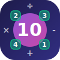

<html lang="ja"><head>
  <meta charset="UTF-8">
  <meta name="viewport" content="width=device-width, initial-scale=1.0">
  <meta name="description" content="43種類の認知トレーニングゲームで毎日脳を鍛えよう。計算・記憶・反射・判断力を楽しく向上。">
  <meta name="theme-color" content="#8b5cf6">
  <title>脳トレマニア</title>
  <link rel="icon" type="image/png" href="favicon.png">
  <link rel="apple-touch-icon" href="icon-192.png">
  <link rel="manifest" href="manifest.json">
  <link rel="preconnect" href="https://fonts.googleapis.com">
  <link rel="preconnect" href="https://fonts.gstatic.com" crossorigin="">
  <link href="https://fonts.googleapis.com/css2?family=Inter:wght@400;500;600;700;800;900&amp;family=Plus+Jakarta+Sans:wght@400;500;600;700;800&amp;family=Noto+Sans+JP:wght@400;700;800&amp;display=swap" rel="stylesheet">
  <link rel="stylesheet" href="css/common.css?v=1775846969">
  <link rel="stylesheet" href="css/visual-calc.css?v=1775846969">
  <link rel="stylesheet" href="css/num-tap.css?v=1775846969">
  <link rel="stylesheet" href="css/memory-matrix.css?v=1775846969">
  <link rel="stylesheet" href="css/color-match.css?v=1775846969">
  <link rel="stylesheet" href="css/n-back.css?v=1775846969">
  <link rel="stylesheet" href="css/flash-math.css?v=1775846969">
  <link rel="stylesheet" href="css/shell-game.css?v=1775846969">
  <link rel="stylesheet" href="css/just-stop.css?v=1775846969">
  <link rel="stylesheet" href="css/sequence-memory.css?v=1775846969">
  <link rel="stylesheet" href="css/emoji-order.css?v=1775846969">
  <link rel="stylesheet" href="css/color-vision.css?v=1775846969">
  <link rel="stylesheet" href="css/mirror-path.css?v=1775846969">
  <link rel="stylesheet" href="css/pair-logic.css?v=1775846969">
  <link rel="stylesheet" href="css/balance-scale.css?v=1775846969">
  <link rel="stylesheet" href="css/pattern-next.css?v=1775846969">
  <link rel="stylesheet" href="css/mental-nav.css?v=1775846969">
  <link rel="stylesheet" href="css/apple-catch.css?v=1775846969">
  <link rel="stylesheet" href="css/num-order.css?v=1775846969">
  <link rel="stylesheet" href="css/obj-count.css?v=1775846969">
  <link rel="stylesheet" href="css/hi-lo.css?v=1775846969">
  <link rel="stylesheet" href="css/color-seq.css?v=1775846969">
  <link rel="stylesheet" href="css/prime-hunt.css?v=1775846969">
  <link rel="stylesheet" href="css/card-flip.css?v=1775846969">
  <link rel="stylesheet" href="css/cube-count.css?v=1775846969">
  <link rel="stylesheet" href="css/make-ten.css?v=1775846969">
  <link rel="stylesheet" href="css/flash-sudoku.css?v=1775846969">
  <link rel="stylesheet" href="css/race-pos.css?v=1775846969">
  <link rel="stylesheet" href="css/otp-memory.css?v=1775846969">
  <link rel="stylesheet" href="css/day-calc.css?v=1775846969">
  <link rel="stylesheet" href="css/arrow-swipe.css?v=1775846969">
  <link rel="stylesheet" href="css/clock-calc.css?v=1775846969">
  <link rel="stylesheet" href="css/lights-out.css?v=1775846969">
  <link rel="stylesheet" href="css/dollar-calc.css?v=1775846969">
  <link rel="stylesheet" href="css/double-detect.css?v=1775846969">
  <link rel="stylesheet" href="css/tax-calc.css?v=1775846969">
  <link rel="stylesheet" href="css/emoji-finder.css?v=1775846969">
  <link rel="stylesheet" href="css/leaderboard.css?v=1775846969">
<link id="googleidentityservice" type="text/css" media="all" href="https://accounts.google.com/gsi/style" rel="stylesheet"></head>

<body>

  <!-- ========== HOME ========== -->
  

    

      

        <!-- Auth: Google Login / User Avatar + Records (grouped) -->
        

        

          

            
            ntea
          

          <button class="btn-records" onclick="showScreen('records')">🏆 記録</button>
          <button class="btn-records" onclick="showScreen('stats')">📊 統計</button>
        

        <button class="btn-settings" onclick="openSettings()" title="設定">⚙️</button>
      

      
🧠

      <h1>脳トレマニア</h1>
      
毎日少しずつ、脳を鍛えよう

    

    <!-- Category Tab Bar -->
    

      <button class="cat-tab" data-cat="calc" onclick="scrollToCategory('cat-calc')">計算・数理</button>
      <button class="cat-tab" data-cat="logic" onclick="scrollToCategory('cat-logic')">論理・推理</button>
      <button class="cat-tab" data-cat="memory" onclick="scrollToCategory('cat-memory')">記憶</button>
      <button class="cat-tab" data-cat="reflex" onclick="scrollToCategory('cat-reflex')">反射・判断</button>
      <button class="cat-tab active" data-cat="perception" onclick="scrollToCategory('cat-perception')">知覚・注意</button>
    

    <!-- Global Leaderboard (Home screen) -->
    

      

        

          🌍
          グローバルランキング
        

      

      

        <button id="glb-tab-alltime" class="glb-tab active" onclick="switchGlobalTab('alltime')" style="flex: 1; padding: 10px 0; font-size: 0.82rem; font-weight: 700; border: none; cursor: pointer; background: rgba(255,255,255,0.06); color: var(--text); transition: all 0.2s;">👑 総合</button>
        <button id="glb-tab-weekly" class="glb-tab" onclick="switchGlobalTab('weekly')" style="flex: 1; padding: 10px 0; font-size: 0.82rem; font-weight: 700; border: none; border-left: 1px solid var(--border-2); cursor: pointer; background: transparent; color: var(--text-3); transition: all 0.2s;">🔥 週間</button>
      

      

        

          
👑

          

            
          

          
あなた

          
2点

        

        

          
🥈

          

            
          

          
中川崇大

          
1点

        

    

    <!-- Today's Pick -->
    

      

        

          🔥
          今日のピックアップ
        

        4/11（土）
      

      

      

        
🌈

        
シーケンスマスター

        
記憶

      

    
      

        
🔦

        
ブラインド数独

        
論理

      

    
      

        
🔄

        
Nバックチャレンジ

        
記憶

      

    

    

    <!-- Dev Pick -->
    

      

        

          🛠️
          開発者ピックアップ
        

      

      

      

        

        
ドットカウンター

        
計算

      

    
      

        

        
メイク10

        
計算

      

    
      

        
📅

        
カレンダーマスター

        
計算

      

    
      

        
⏳

        
クロックマスター

        
計算

      

    
      

        
💡

        
ライトアウト

        
論理

      
👑 1手

    
      

        
🔲

        
ライトマトリックス

        
記憶

      
🌱 1

    
      

        
🎴

        
絵文字メモリー

        
記憶

      

    
      

        
🌈

        
シーケンスマスター

        
記憶

      

    
      

        
🔐

        
コードメモリー

        
記憶

      

    
      

        
🔢

        
ナンバータッチ

        
反射

      

    
      

        
↗️

        
アローマスター

        
反射

      

    
      

        
🎩

        
シェルゲーム

        
知覚

      
👑 150

    
      

        
👁️

        
カラービジョン

        
知覚

      

    

      

        <button class="dev-pick-more-btn" id="dev-pick-more-btn" onclick="toggleDevPick()">
          もっと見る
          ▼
        </button>
      

    

    <!-- Category: 計算・数理 -->
    

      

        <h2>計算・数理</h2>
        
数を素早く正確に扱う力を鍛える

      

      

        

          

            
          

          

            <h2>ドットカウンター</h2>
            
丸の数を数えたり、計算したりしよう

          

          
計算

        

        

          
⚡️

          

            <h2>フラッシュサム</h2>
            
一瞬表示される数字を足そう

          

          
計算・瞬視

        

        

          
⚖️

          

            <h2>バランスバトル</h2>
            
流れる数字の和を比べてどちらが重いか答えよう

          

          
暗算

        

        

          
🔬

          

            <h2>素数ハント</h2>
            
グリッドの中から素数だけを選び出そう

          

          
数論

        

        

          

            
          

          

            <h2>メイク10</h2>
            
4つの数字を四則演算で10にしよう

          

          
暗算

        

        

          
🏃

          

            <h2>レースビジョン</h2>
            
抜いたり抜かれたりして、最終何位か当てよう

          

          
暗算

        

        

          
📅

          

            <h2>カレンダーマスター</h2>
            
日付から曜日を当てよう

          

          
暗算

        

        

          
💱

          

            <h2>ドル換算</h2>
            
円とドルを素早く換算しよう

          

          
暗算

        

        

          
⏳

          

            <h2>クロックマスター</h2>
            
指定された時間を素早く計算しよう

          

          
計算

        

        

          
🧾

          

            <h2>消費税計算</h2>
            
税込み価格を素早く答えよう

          

          
暗算

        

      

    

    <!-- Category: 論理・推理 -->
    

      

        <h2>論理・推理</h2>
        
規則の発見・空間認知・言語思考を鍛える

      

      

        

          
🃏

          

            <h2>ペアロジック</h2>
            
ヒントから正しい並び順を推理しよう

          

          
推論

        

        

          
🔮

          

            <h2>パターンブレイカー</h2>
            
数列や色のパターンから次を予測しよう

          

          
推論

        

        

          
🪞

          

            <h2>リバースナビ</h2>
            
反転した矢印を読み解きゴールを探せ

          

          
空間認知

        

        

          
🗺️

          

            <h2>メンタルナビ</h2>
            
矢印の指示を頭の中でたどりゴールを探せ

          

          
空間認知

        

        

          
🔦

          

            <h2>ブラインド数独</h2>
            
暗闇の数独！タップしたマスだけ光る

          

          
論理

        

        

          
💡

          

            <h2>ライトアウト</h2>
            
すべての明かりを消灯させよう

          

          
論理

        
👑 1手

      

    

    <!-- Category: 記憶 -->
    

      

        <h2>記憶</h2>
        
短期記憶・ワーキングメモリを鍛える

      

      

        

          
🔲

          

            <h2>ライトマトリックス</h2>
            
光ったマスの位置を記憶してタップ

          

          
記憶

        
🌱 1

        

          
🔄

          

            <h2>Nバックチャレンジ</h2>
            
N個前の図形と同じか答えよう

          

          
Wメモリ

        

        

          
🌈

          

            <h2>シーケンスマスター</h2>
            
点灯する色の順番を覚えて再現しよう

          

          
順序記憶

        

        

          
🎴

          

            <h2>エモジメモリー</h2>
            
絵文字の順番を覚えて正確に再現しよう

          

          
順序記憶

        

        

          
🔍

          

            <h2>絵文字さがし</h2>
            
増えた絵文字を探し当てよう

          

          
記憶

        

        

          
🎨

          

            <h2>カラーチェーン</h2>
            
一度に表示された色の並びを記憶して再現しよう

          

          
記憶スパン

        

        

          
🀄

          

            <h2>ペアフリップ</h2>
            
同じ絵柄のペアを少ない手数で揃えよう

          

          
空間記憶

        

        

          
🔐

          

            <h2>コードメモリー</h2>
            
ワンタイムパスワードを記憶して入力しよう

          

          
記憶

        

      

    

    <!-- Category: 反射・判断 -->
    

      

        <h2>反射・判断</h2>
        
素早い反応速度と判断力・抑制力を鍛える

      

      

        

          
🔢

          

            <h2>ナンバータッチ</h2>
            
数字を順番に素早くタップしよう

          

          
反射

        

        

          
🎭

          

            <h2>カラートラップ</h2>
            
「文字の色」を素早く判断しよう

          

          
抑制

        

        

          
🍎

          

            <h2>アップルキャッチ</h2>
            
落ちてくる🍎だけをタップ！🍏は触るな！

          

          
反射

        

        

          
♠️

          

            <h2>ハイ＆ロー</h2>
            
次のカードは今より高い？低い？当て続けよう

          

          
判断

        

        

          
⏱️

          

            <h2>パーフェクトストップ</h2>
            
目標の時間にピッタり止めよう

          

          
時間感覚

        
🏆 44

        

          
↗️

          

            <h2>アローマスター</h2>
            
色に従って正しい方向へスワイプしよう

          

          
反射

        

        

          
🃏

          

            <h2>ダブル検知</h2>
            
同じ数字が出たら即押し！最初の枚数も答えよう

          

          
判断

        

      

    

    <!-- Category: 知覚・注意 -->
    

      

        <h2>知覚・注意</h2>
        
視覚的な認識力・注意力・空間把握力を鍛える

      

      

        

          
🔀

          

            <h2>ナンバーオーダー</h2>
            
バラバラな数字を小さい順にタップしよう

          

          
視覚探索

        

        

          
🔵

          

            <h2>フラッシュカウント</h2>
            
一瞬表示されるアイコンの数を数えよう

          

          
瞬視

        

        

          
🧊

          

            <h2>キューブカウント</h2>
            
積み上げられた立体ブロックの数を数えよう

          

          
空間認識

        

        

          
🎩

          

            <h2>シェルゲーム</h2>
            
星が入ったカップの動きを追おう

          

          
動体視力

        
👑 150

        

          
👁️

          

            <h2>カラービジョン</h2>
            
1つだけ色が違うタイルを見つけよう

          

          
色彩感覚

        

      

    

  

  <!-- ========== GAME STATS ========== -->
  

    <nav class="nav">
      <button class="btn-back" onclick="showScreen('records')">← 記録一覧</button>
      <h1 id="game-stats-title"></h1>
    <button class="btn-rule">ℹ️</button></nav>
    

  

  <!-- ========== RECORDS ========== -->
  

    <nav class="nav">
      <button class="btn-back" onclick="showScreen('home')">🏠</button>
      <h1>記録一覧</h1>
    <button class="btn-rule">ℹ️</button></nav>
    

      

      

        
ランク分布

        

      

      

    

  

  <!-- ========== STATS ========== -->
  

    <nav class="nav">
      <button class="btn-back" onclick="showScreen('home')">🏠</button>
      <h1>統計</h1>
    <button class="btn-rule">ℹ️</button></nav>
    

  

  <!-- ========== VISUAL CALC ========== -->
  

    <nav class="nav">
      <button class="btn-back" onclick="showScreen('home')">🏠</button>
      <h1>ドットカウンター</h1>
    <button class="btn-rule">ℹ️</button><button class="btn-rule">🏆</button></nav>

    

      

        <button class="diff-btn selected" onclick="vcSetDiff(this,'easy')">かんたん</button>
        <button class="diff-btn" onclick="vcSetDiff(this,'normal')">ふつう</button>
        <button class="diff-btn" onclick="vcSetDiff(this,'hard')">むずかしい</button>
      

      

        

          
スコア

          
0

        

        

          
問題

          
-/10

        

        

          
連続正解

          
0

        

        

          
ベスト

          
0

        

      

      

        

      

      
スタートを押してください

      

      <!-- 凡例: 丸のサイズの意味 -->
      

        

          大 = 10
        

        

          中 = 5
        

        

          小 = 1
        

      

      

        
?

        

          <button class="numpad-btn" onclick="vcNumpad('7')">7</button>
          <button class="numpad-btn" onclick="vcNumpad('8')">8</button>
          <button class="numpad-btn" onclick="vcNumpad('9')">9</button>
          <button class="numpad-btn del" onclick="vcNumpad('del')">⌫</button>

          <button class="numpad-btn" onclick="vcNumpad('4')">4</button>
          <button class="numpad-btn" onclick="vcNumpad('5')">5</button>
          <button class="numpad-btn" onclick="vcNumpad('6')">6</button>
          <button class="numpad-btn ok" onclick="vcNumpad('ok')">OK</button>

          <button class="numpad-btn" onclick="vcNumpad('1')">1</button>
          <button class="numpad-btn" onclick="vcNumpad('2')">2</button>
          <button class="numpad-btn" onclick="vcNumpad('3')">3</button>

          <button class="numpad-btn zero" onclick="vcNumpad('0')">0</button>
        

        <button class="btn-primary" id="vc-start-btn" onclick="vcStart()">スタート</button>
      

    
<!-- /.game-content -->
  
<!-- /#visual-calc -->

  <!-- ========== NUM TAP ========== -->
  

    <nav class="nav">
      <button class="btn-back" onclick="showScreen('home')">🏠</button>
      <h1>ナンバータッチ</h1>
    <button class="btn-rule">ℹ️</button><button class="btn-rule">🏆</button></nav>

    

      <!-- 
 removed as per logic change 10~20 random -->

      

        

          
ラウンド

          
1

        

        

          
タイム

          
0.0s

        

        

          
ベスト

          
--

        

      

      
次にタップ: ?

      

      <button class="btn-primary" id="nt-start-btn" onclick="ntStart()">スタート</button>

    
<!-- /.game-content -->
  
<!-- /#num-tap -->

  <!-- ========== MEMORY MATRIX ========== -->
  

    <nav class="nav">
      <button class="btn-back" onclick="showScreen('home')">🏠</button>
      <h1>ライトマトリックス</h1>
    <button class="btn-rule">ℹ️</button><button class="btn-rule">🏆</button></nav>

    

      

        <button class="diff-btn selected" onclick="mmSetDiff(this,'easy')">かんたん</button>
        <button class="diff-btn" onclick="mmSetDiff(this,'normal')">ふつう</button>
        <button class="diff-btn" onclick="mmSetDiff(this,'hard')">むずかしい</button>
      

      

        

          
ラウンド

          
1

        

        

          
ベスト

          
--

        

      

      
スタートを押してください

      

        

      

      

        <button class="btn-primary" id="mm-start-btn" onclick="mmStart()">スタート</button>
        <button class="btn-primary" id="mm-confirm-btn" onclick="mmConfirm()" style="display:none;">確定する</button>
      

    
<!-- /.game-content -->
  
<!-- /#memory-matrix -->

  <!-- ========== COLOR MATCH ========== -->
  

    <nav class="nav">
      <button class="btn-back" onclick="showScreen('home')">🏠</button>
      <h1>カラートラップ</h1>
    <button class="btn-rule">ℹ️</button><button class="btn-rule">🏆</button></nav>
    

      

        

          
スコア

          
0

        

        

          
ベスト

          
0

        

      

      

        

      

      

        
?

        
スタートを押してください

      

      

        

          <button class="cm-btn" onclick="cmTap('red')">あか</button>
          <button class="cm-btn" onclick="cmTap('blue')">あお</button>
          <button class="cm-btn" onclick="cmTap('green')">みどり</button>
          <button class="cm-btn" onclick="cmTap('yellow')">きいろ</button>
        

        <button class="btn-primary" id="cm-start-btn" onclick="cmStart()" style="margin-top:20px;">スタート</button>
      

    

  

  <!-- ========== N-BACK ========== -->
  

    <nav class="nav">
      <button class="btn-back" onclick="showScreen('home')">🏠</button>
      <h1>Nバックチャレンジ</h1>
    <button class="btn-rule">ℹ️</button><button class="btn-rule">🏆</button></nav>
    

      

        <button class="diff-btn selected" onclick="nbSetDiff(this,'1')">1バック</button>
        <button class="diff-btn" onclick="nbSetDiff(this,'2')">2バック</button>
        <button class="diff-btn" onclick="nbSetDiff(this,'3')">3バック</button>
      

      

        

          
連続正解

          
0

        

        

          
ベスト

          
0

        

      

      

        

      

      

        

        
スタートを押してください

      

      

        

          <button class="btn-outline" style="border-color:var(--secondary);color:var(--secondary);" onclick="nbAnswer(false)">❌ 違う</button>
          <button class="btn-outline" style="border-color:var(--accent);color:var(--accent);" onclick="nbAnswer(true)">⭕️ 同じ</button>
        

        <button class="btn-primary" id="nb-start-btn" onclick="nbStart()" style="margin-top:20px;">スタート</button>
      

    

  

  <!-- ========== FLASH MATH ========== -->
  

    <nav class="nav">
      <button class="btn-back" onclick="showScreen('home')">🏠</button>
      <h1>フラッシュサム</h1>
    <button class="btn-rule">ℹ️</button><button class="btn-rule">🏆</button></nav>
    

      

        <button class="diff-btn" onclick="fmSetType(this,'visual')">ビジュアル</button>
        <button class="diff-btn selected" onclick="fmSetType(this,'number')">数字</button>
        <button class="diff-btn" onclick="fmSetType(this,'mixed')">混合</button>
      

      

        <button class="diff-btn selected" onclick="fmSetDiff(this,'easy')">かんたん</button>
        <button class="diff-btn" onclick="fmSetDiff(this,'normal')">ふつう</button>
        <button class="diff-btn" onclick="fmSetDiff(this,'hard')">むずかしい</button>
      

      

        

          
ラウンド

          
1

        

        

          
ベスト

          
1

        

      

      

        

      

      

        
?

        

        
集中してください！

      

      

        
?

        

          <button class="numpad-btn" onclick="fmNumpad('7')">7</button>
          <button class="numpad-btn" onclick="fmNumpad('8')">8</button>
          <button class="numpad-btn" onclick="fmNumpad('9')">9</button>
          <button class="numpad-btn del" onclick="fmNumpad('del')">⌫</button>

          <button class="numpad-btn" onclick="fmNumpad('4')">4</button>
          <button class="numpad-btn" onclick="fmNumpad('5')">5</button>
          <button class="numpad-btn" onclick="fmNumpad('6')">6</button>
          <button class="numpad-btn ok" onclick="fmNumpad('ok')">OK</button>

          <button class="numpad-btn" onclick="fmNumpad('1')">1</button>
          <button class="numpad-btn" onclick="fmNumpad('2')">2</button>
          <button class="numpad-btn" onclick="fmNumpad('3')">3</button>

          <button class="numpad-btn zero" onclick="fmNumpad('0')">0</button>
        

        <button class="btn-primary" id="fm-start-btn" onclick="fmStart()" style="margin-top:20px;">スタート</button>
      

    

  

      

        

          
スコア

          
0

        

        

          
ベスト

          
0

        

      

      

        

      

      

        

        
スタートを押してください

      

      

        <button class="btn-primary" id="ts-start-btn" onclick="tsStart()" style="margin-top:20px;">スタート</button>
      

    
  
      

        

          
スコア

          
0

        

        

          
ベスト

          
0

        

      

      

        

      

      

        

        
スタートを押してください

      

      

        
?

        

          <button class="numpad-btn" onclick="slNumpad('7')">7</button>
          <button class="numpad-btn" onclick="slNumpad('8')">8</button>
          <button class="numpad-btn" onclick="slNumpad('9')">9</button>
          <button class="numpad-btn del" onclick="slNumpad('del')">⌫</button>

          <button class="numpad-btn" onclick="slNumpad('4')">4</button>
          <button class="numpad-btn" onclick="slNumpad('5')">5</button>
          <button class="numpad-btn" onclick="slNumpad('6')">6</button>
          <button class="numpad-btn ok" onclick="slNumpad('ok')">OK</button>

          <button class="numpad-btn" onclick="slNumpad('1')">1</button>
          <button class="numpad-btn" onclick="slNumpad('2')">2</button>
          <button class="numpad-btn" onclick="slNumpad('3')">3</button>

          <button class="numpad-btn zero" onclick="slNumpad('0')">0</button>
        

        <button class="btn-primary" id="sl-start-btn" onclick="slStart()" style="margin-top:20px;">スタート</button>
      

    
  
      

        

          
スコア

          
0

        

        

          
ベスト

          
0

        

      

      

        

      

      

      

        
?

        
スタートを押してください

      

      

        

          <button class="btn-outline ss-btn" onclick="ssAnswer('left')">← 左</button>
          <button class="btn-outline ss-btn" onclick="ssAnswer('right')">右 →</button>
        

        <button class="btn-primary" id="ss-start-btn" onclick="ssStart()" style="margin-top:20px;">スタート</button>
      

    
  

  <!-- ========== SHELL GAME ========== -->
  

    <nav class="nav">
      <button class="btn-back" onclick="showScreen('home')">🏠</button>
      <h1>シェルゲーム</h1>
    <button class="btn-rule">ℹ️</button><button class="btn-rule">🏆</button></nav>
    

      

        <button class="diff-btn selected" onclick="sgSetDiff(this,'easy')">かんたん</button>
        <button class="diff-btn" onclick="sgSetDiff(this,'normal')">ふつう</button>
        <button class="diff-btn" onclick="sgSetDiff(this,'hard')">むずかしい</button>
        <button class="diff-btn oni-btn" onclick="sgSetDiff(this,'oni')">鬼</button>
      

      

        

          
スコア

          
0

        

        

          
ベスト

          
0

        

      

      
スタートを押してください

      

      

        <button class="btn-primary" id="sg-start-btn" onclick="sgStart()" style="margin-top:20px;">スタート</button>
      

    

  

  <!-- ========== JUST STOP ========== -->
  

    <nav class="nav">
      <button class="btn-back" onclick="showScreen('home')">🏠</button>
      <h1>パーフェクトストップ</h1>
    <button class="btn-rule">ℹ️</button><button class="btn-rule">🏆</button></nav>
    

      

        

          
スコア

          
0

        

        

          
ラウンド

          
- / 5

        

        

          
ベスト

          
0

        

      

      

        
目標タイム

        
--.-

        
秒

      

      

        

        

          
⏱️

        

      

      

      

      

        <button class="js-stop-btn" id="js-stop-btn" onclick="jsAction()">ストップ！</button>
        <button class="btn-primary" id="js-start-btn" onclick="jsStart()">スタート</button>
      

    

  

          
0

        
        

          
ベスト

          
0

        

      
      

        

      

      
スタートを押してください

      

      

      

      

        <button class="btn-outline" id="wl-clear-btn" onclick="wlClear()" style="display:none;">まちがえ</button>
        <button class="btn-primary" id="wl-start-btn" onclick="wlStart()">スタート</button>
      

    
  

  <!-- ========== SEQUENCE MEMORY ========== -->
  

    <nav class="nav">
      <button class="btn-back" onclick="showScreen('home')">🏠</button>
      <h1>シーケンスマスター</h1>
    <button class="btn-rule">ℹ️</button><button class="btn-rule">🏆</button></nav>
    

      

        

          
スコア

          
0

        

        

          
ベスト

          
0

        

      

      

        
レベル -

        

          <button class="sm-btn" id="sm-btn-green" onclick="smTap('green')" disabled=""></button>
          <button class="sm-btn" id="sm-btn-red" onclick="smTap('red')" disabled=""></button>
          <button class="sm-btn" id="sm-btn-blue" onclick="smTap('blue')" disabled=""></button>
          <button class="sm-btn" id="sm-btn-yellow" onclick="smTap('yellow')" disabled=""></button>
        

        
スタートを押してください

      

      

        <button class="btn-primary" id="sm-start-btn" onclick="smStart()">スタート</button>
      

    

  

  <!-- ========== EMOJI ORDER ========== -->
  

    <nav class="nav">
      <button class="btn-back" onclick="showScreen('home')">🏠</button>
      <h1>エモジメモリー</h1>
    <button class="btn-rule">ℹ️</button><button class="btn-rule">🏆</button></nav>
    

      <!-- Length selector -->
      

        <button class="diff-btn selected" onclick="eoSetLen(this, 5)">5個</button>
        <button class="diff-btn" onclick="eoSetLen(this, 10)">10個</button>
        <button class="diff-btn" onclick="eoSetLen(this, 'custom')">カスタム</button>
      

      <!-- Custom length control -->
      

        <button class="eo-custom-btn" onclick="eoCustomChange(-1)">−</button>
        7
        個
        <button class="eo-custom-btn" onclick="eoCustomChange(1)">＋</button>
      

      <!-- Difficulty selector -->
      

        <button class="diff-btn" onclick="eoSetDiff(this,'easy')">かんたん</button>
        <button class="diff-btn selected" onclick="eoSetDiff(this,'normal')">ふつう</button>
        <button class="diff-btn" onclick="eoSetDiff(this,'hard')">むずかしい</button>
      

      <!-- Score bar -->
      

        

          
ラウンド

          
0

        

        

          
ベスト

          
0

        

      

      <!-- Flash stage -->
      

        

        

        

      

      
スタートを押してください

      <!-- Answer stage -->
      

        

        

      

      

        

          <button class="btn-outline" id="eo-undo-btn" onclick="eoUndo()" style="display:none;">↩ 取り消し</button>
          <button class="btn-primary" id="eo-confirm-btn" onclick="eoConfirm()" style="display:none;">✅ 確定</button>
        

        <button class="btn-primary" id="eo-start-btn" onclick="eoStart()">スタート</button>
      

    
<!-- /.game-content -->
  
<!-- /#emoji-order -->

  <!-- ========== COLOR VISION ========== -->
  

    <nav class="nav">
      <button class="btn-back" onclick="showScreen('home')">🏠</button>
      <h1>カラービジョン</h1>
    <button class="btn-rule">ℹ️</button><button class="btn-rule">🏆</button></nav>
    

      

        <button class="diff-btn" onclick="cvSetDiff(this,'easy')">かんたん</button>
        <button class="diff-btn selected" onclick="cvSetDiff(this,'normal')">ふつう</button>
        <button class="diff-btn" onclick="cvSetDiff(this,'hard')">むずかしい</button>
      

      

        

          
スコア

          
0

        

        

          
ベスト

          
0

        

      

      

        

      

      

        
スタートを押してください

        

      

      

        <button class="btn-primary" id="cv-start-btn" onclick="cvStart()" style="margin-top:20px;">スタート</button>
      

    

  

      

        

          
スコア

          
0

        

        

          
ベスト

          
0

        

      

      

        

      

      

        
スタートを押してください

        

        

      

      

        <button class="btn-primary" id="cc-start-btn" onclick="ccStart()" style="margin-top:20px;">スタート</button>
      

    
  

  <!-- ========== MIRROR PATH ========== -->
  

    <nav class="nav">
      <button class="btn-back" onclick="showScreen('home')">🏠</button>
      <h1>リバースナビ</h1>
    <button class="btn-rule">ℹ️</button><button class="btn-rule">🏆</button></nav>
    

      

        <button class="diff-btn selected" onclick="mpSetDiff(this,'easy')">かんたん</button>
        <button class="diff-btn" onclick="mpSetDiff(this,'normal')">ふつう</button>
        <button class="diff-btn" onclick="mpSetDiff(this,'hard')">むずかしい</button>
      

      

        

          
スコア

          
0

        

        

          
ベスト

          
0

        

      

      

        

      

      

      

        <button class="btn-primary" id="mp-start-btn" onclick="mpStart()" style="margin-top:12px;">スタート</button>
      

    

  

  <!-- ========== PAIR LOGIC ========== -->
  

    <nav class="nav">
      <button class="btn-back" onclick="showScreen('home')">🏠</button>
      <h1>ペアロジック</h1>
    <button class="btn-rule">ℹ️</button><button class="btn-rule">🏆</button></nav>
    

      

        <button class="diff-btn selected" onclick="plSetDiff(this,'easy')">かんたん</button>
        <button class="diff-btn" onclick="plSetDiff(this,'normal')">ふつう</button>
        <button class="diff-btn" onclick="plSetDiff(this,'hard')">むずかしい</button>
      

      

        

          
スコア

          
0

        

        

          
ベスト

          
0

        

      

      

        

      

      

      

        <button class="btn-primary" id="pl-start-btn" onclick="plStart()" style="margin-top:12px;">スタート</button>
      

    

  

          
0

        
        

          
ベスト

          
0

        

      

      

        

      

      

        
この言葉と関係するのは？

        
？

      

      

      

        <button class="btn-primary" id="cw-start-btn" onclick="cwStart()">スタート</button>
      

    
  
          
0

        
        

          
残り時間

          
30

        

        

          
ベスト

          
0

        

      
      

        

      

      
大きい数をタップ！

      

        <button class="bn-btn" id="bn-left" onclick="bnTap(0)">?</button>
        <button class="bn-btn" id="bn-right" onclick="bnTap(1)">?</button>
      

      

        <button class="btn-primary" id="bn-start-btn" onclick="bnStart()" style="margin-top:20px;">スタート</button>
      

    
  

  <!-- ========== BALANCE SCALE ========== -->
  

    <nav class="nav">
      <button class="btn-back" onclick="showScreen('home')">🏠</button>
      <h1>バランスバトル</h1>
    <button class="btn-rule">ℹ️</button><button class="btn-rule">🏆</button></nav>
    

      

        <button class="diff-btn selected" onclick="blSetDiff(this,'easy')">かんたん</button>
        <button class="diff-btn" onclick="blSetDiff(this,'normal')">ふつう</button>
        <button class="diff-btn" onclick="blSetDiff(this,'hard')">むずかしい</button>
      

      

        

          
スコア

          
0

        

        

          
ベスト

          
0

        

      

      

        

      

      
スタートを押してください

      

        

          
左

          

          

        

        

          

        

        

          
右

          

          

        

      

      

        <button class="bl-answer-btn bl-left-btn" onclick="blAnswer('L')">⬅ 左が重い</button>
        <button class="bl-answer-btn bl-right-btn" onclick="blAnswer('R')">右が重い ➡</button>
      

      

        <button class="btn-primary" id="bl-start-btn" onclick="blStart()">スタート</button>
      

    

  

  <!-- ========== PATTERN NEXT ========== -->
  

    <nav class="nav">
      <button class="btn-back" onclick="showScreen('home')">🏠</button>
      <h1>パターンブレイカー</h1>
    <button class="btn-rule">ℹ️</button><button class="btn-rule">🏆</button></nav>
    

      

        

          
スコア

          
0

        

        

          
ベスト

          
0

        

      

      

        

      

      

      

      

        <button class="btn-primary" id="pn-start-btn" onclick="pnStart()">スタート</button>
      

    

  

  <!-- ========== MENTAL NAV ========== -->
  

    <nav class="nav">
      <button class="btn-back" onclick="showScreen('home')">🏠</button>
      <h1>メンタルナビ</h1>
    <button class="btn-rule">ℹ️</button><button class="btn-rule">🏆</button></nav>
    

      

        <button class="diff-btn selected" onclick="mnSetDiff(this,'easy')">かんたん</button>
        <button class="diff-btn" onclick="mnSetDiff(this,'normal')">ふつう</button>
        <button class="diff-btn" onclick="mnSetDiff(this,'hard')">むずかしい</button>
      

      

        

          
スコア

          
0

        

        

          
ベスト

          
0

        

      

      

        

      

      

        
指示

        
スタートを押してください

      

      

        

      

      

        <button class="btn-primary" id="mn-start-btn" onclick="mnStart()">スタート</button>
      

    

  

  <!-- ========== APPLE CATCH ========== -->
  

    <nav class="nav">
      <button class="btn-back" onclick="showScreen('home')">🏠</button>
      <h1>アップルキャッチ</h1>
    <button class="btn-rule">ℹ️</button><button class="btn-rule">🏆</button></nav>
    

      

        
スコア

        
0

      

      
❤️❤️❤️

      

        
残り

        
30

      

    

    

      

    

    

      

        
🍎

        
🍎 だけをタップ！ 🍏 はタッチしないで！

        <button class="btn-primary" onclick="acStart()">スタート</button>
        
ベスト: 0

      

    

  

      

        

          
スコア

          
0

        

        

          
残り

          
60

        

        

          
ベスト

          
0

        

      

      

        

      

      

        

      

      

        
?

        

          <button class="numpad-btn" onclick="spdNumpad('7')">7</button>
          <button class="numpad-btn" onclick="spdNumpad('8')">8</button>
          <button class="numpad-btn" onclick="spdNumpad('9')">9</button>
          <button class="numpad-btn del" onclick="spdNumpad('del')">⌫</button>
          <button class="numpad-btn" onclick="spdNumpad('4')">4</button>
          <button class="numpad-btn" onclick="spdNumpad('5')">5</button>
          <button class="numpad-btn" onclick="spdNumpad('6')">6</button>
          <button class="numpad-btn ok" onclick="spdNumpad('ok')">OK</button>
          <button class="numpad-btn" onclick="spdNumpad('1')">1</button>
          <button class="numpad-btn" onclick="spdNumpad('2')">2</button>
          <button class="numpad-btn" onclick="spdNumpad('3')">3</button>
          <button class="numpad-btn zero" onclick="spdNumpad('0')">0</button>
        

        <button class="btn-primary" id="spd-start-btn" onclick="spdStart()">スタート</button>
      

    
  
      

        

          
スコア

          
0

        

        

          
残り

          
60

        

        

          
ベスト

          
0

        

      

      

        

      

      

        

      

      

        

          <button class="eqt-btn eqt-btn-o" onclick="eqtTap(true)">⭕</button>
          <button class="eqt-btn eqt-btn-x" onclick="eqtTap(false)">✖</button>
        

        <button class="btn-primary" id="eqt-start-btn" onclick="eqtStart()" style="margin-top:16px;">スタート</button>
      

    
  

  <!-- ========== NUM ORDER ========== -->
  

    <nav class="nav">
      <button class="btn-back" onclick="showScreen('home')">🏠</button>
      <h1>ナンバーオーダー</h1>
    <button class="btn-rule">ℹ️</button><button class="btn-rule">🏆</button></nav>
    

      

        <button class="diff-btn selected" onclick="norSetDiff(this,'easy')">かんたん</button>
        <button class="diff-btn" onclick="norSetDiff(this,'normal')">ふつう</button>
        <button class="diff-btn" onclick="norSetDiff(this,'hard')">むずかしい</button>
      

      

        

          
スコア

          
0

        

        

          
残り

          
60

        

        

          
ベスト

          
0

        

      

      

        

      

      
小さい順にタップ！

      

        

      

      

        <button class="btn-primary" id="nor-start-btn" onclick="norStart()">スタート</button>
      

    

  

  <!-- ========== OBJ COUNT ========== -->
  

    <nav class="nav">
      <button class="btn-back" onclick="showScreen('home')">🏠</button>
      <h1>フラッシュカウント</h1>
    <button class="btn-rule">ℹ️</button><button class="btn-rule">🏆</button></nav>
    

      

        <button class="diff-btn selected" onclick="ocSetDiff(this,'easy')">かんたん</button>
        <button class="diff-btn" onclick="ocSetDiff(this,'normal')">ふつう</button>
        <button class="diff-btn" onclick="ocSetDiff(this,'hard')">むずかしい</button>
      

      

        

          
問題

          
0/10

        

        

          
正解

          
0

        

        

          
ベスト

          
0

        

      

      
スタートを押してください

      

        

      

      

        
?

        

          <button class="numpad-btn" onclick="ocNumpad('7')">7</button>
          <button class="numpad-btn" onclick="ocNumpad('8')">8</button>
          <button class="numpad-btn" onclick="ocNumpad('9')">9</button>
          <button class="numpad-btn del" onclick="ocNumpad('del')">⌫</button>
          <button class="numpad-btn" onclick="ocNumpad('4')">4</button>
          <button class="numpad-btn" onclick="ocNumpad('5')">5</button>
          <button class="numpad-btn" onclick="ocNumpad('6')">6</button>
          <button class="numpad-btn ok" onclick="ocNumpad('ok')">OK</button>
          <button class="numpad-btn" onclick="ocNumpad('1')">1</button>
          <button class="numpad-btn" onclick="ocNumpad('2')">2</button>
          <button class="numpad-btn" onclick="ocNumpad('3')">3</button>
          <button class="numpad-btn zero" onclick="ocNumpad('0')">0</button>
        

        <button class="btn-primary" id="oc-start-btn" onclick="ocStart()">スタート</button>
      

    

  

  <!-- ========== HI-LO ========== -->
  

    <nav class="nav">
      <button class="btn-back" onclick="showScreen('home')">🏠</button>
      <h1>ハイ＆ロー</h1>
    <button class="btn-rule">ℹ️</button><button class="btn-rule">🏆</button></nav>
    

      

        

          
累計正解

          
0

        

        

          
残り枚数

          
52

        

        

          
ベスト

          
0

        

      

      

        

          

            
A

            
♠

          

        

        
次のカードは？

      

      

        

          <button class="hl-btn hl-btn-hi" onclick="hlTap('high')">↑ ハイ</button>
          <button class="hl-btn hl-btn-lo" onclick="hlTap('low')">↓ ロー</button>
        

        <button class="btn-primary" id="hl-start-btn" onclick="hlStart()" style="margin-top:16px;">スタート</button>
      

    

  

  <!-- ========== COLOR SEQ ========== -->
  

    <nav class="nav">
      <button class="btn-back" onclick="showScreen('home')">🏠</button>
      <h1>カラーチェーン</h1>
    <button class="btn-rule">ℹ️</button><button class="btn-rule">🏆</button></nav>
    

      

        <button class="diff-btn selected" onclick="cseqSetDiff(this,'easy')">かんたん</button>
        <button class="diff-btn" onclick="cseqSetDiff(this,'normal')">ふつう</button>
        <button class="diff-btn" onclick="cseqSetDiff(this,'hard')">むずかしい</button>
      

      

        

          
スコア

          
0

        

        

          
ベスト

          
0

        

      

      

        

        

        

          <button class="cseq-color-btn" style="background:#f43f5e;" onclick="cseqTap(0)" disabled=""></button>
          <button class="cseq-color-btn" style="background:#3b82f6;" onclick="cseqTap(1)" disabled=""></button>
          <button class="cseq-color-btn" style="background:#facc15;" onclick="cseqTap(2)" disabled=""></button>
          <button class="cseq-color-btn" style="background:#10b981;" onclick="cseqTap(3)" disabled=""></button>
          <button class="cseq-color-btn" style="background:#8b5cf6;" onclick="cseqTap(4)" disabled=""></button>
        

      

      

        <button class="btn-primary" id="cseq-start-btn" onclick="cseqStart()">スタート</button>
      

    

  

  <!-- ========== PRIME HUNT ========== -->
  

    <nav class="nav">
      <button class="btn-back" onclick="showScreen('home')">🏠</button>
      <h1>素数ハント</h1>
    <button class="btn-rule">ℹ️</button><button class="btn-rule">🏆</button></nav>
    

      

        <button class="diff-btn selected" onclick="phSetDiff(this,'easy')">かんたん</button>
        <button class="diff-btn" onclick="phSetDiff(this,'normal')">ふつう</button>
        <button class="diff-btn" onclick="phSetDiff(this,'hard')">むずかしい</button>
      

      

        

          
スコア

          
0

        

        

          
残り

          
60

        

        

          
ベスト

          
0

        

      

      

        

      

      
素数をタップしよう！

      

        

      

      

        <button class="btn-primary" id="ph-start-btn" onclick="phStart()">スタート</button>
      

    

  

      

        

          
スコア

          
0

        

        

          
残り

          
60

        

        

          
ベスト

          
0

        

      

      

        

      

      

        

          
3

          

          
4

        

        
?

        

          
5

          

          
7

        

      

      

        

          <button class="fcmp-btn" onclick="fcmpTap('&gt;')">＞</button>
          <button class="fcmp-btn" onclick="fcmpTap('=')">＝</button>
          <button class="fcmp-btn" onclick="fcmpTap('&lt;')">＜</button>
        

        <button class="btn-primary" id="fcmp-start-btn" onclick="fcmpStart()" style="margin-top:14px;">スタート</button>
      

    
  

  <!-- ========== CARD FLIP ========== -->
  

    <nav class="nav">
      <button class="btn-back" onclick="showScreen('home')">🏠</button>
      <h1>ペアフリップ</h1>
    <button class="btn-rule">ℹ️</button><button class="btn-rule">🏆</button></nav>
    

      

        <button class="diff-btn selected" onclick="cflipSetDiff(this,'easy')">かんたん</button>
        <button class="diff-btn" onclick="cflipSetDiff(this,'normal')">ふつう</button>
        <button class="diff-btn" onclick="cflipSetDiff(this,'hard')">むずかしい</button>
      

      

        

          
手数

          
0

        

        

          
ベスト

          
-

        

      

      
カードをめくってペアを揃えよう

      

        

      

      

        <button class="btn-primary" id="cflip-start-btn" onclick="cflipStart()">スタート</button>
      

    

  

      

        

          
スコア

          
0

        

        

          
残り

          
60

        

        

          
ベスト

          
0

        

      

      

        

      

      

        

          

            
予算

            
¥0

          

          

            
合計

            
¥0

          

        

        

          

        

        

        <button class="bplan-confirm-btn" id="bplan-confirm-btn" onclick="bplanConfirm()" disabled="">購入する</button>
      

      

        <button class="btn-primary" id="bplan-start-btn" onclick="bplanStart()">スタート</button>
      

    
  

  <!-- ========== CUBE COUNT ========== -->
  

    <nav class="nav">
      <button class="btn-back" onclick="showScreen('home')">🏠</button>
      <h1>キューブカウント</h1>
    <button class="btn-rule">ℹ️</button><button class="btn-rule">🏆</button></nav>
    

      

        <button class="diff-btn selected" onclick="ccntSetDiff(this,'easy')">かんたん</button>
        <button class="diff-btn" onclick="ccntSetDiff(this,'normal')">ふつう</button>
        <button class="diff-btn" onclick="ccntSetDiff(this,'hard')">むずかしい</button>
      

      

        

          
問題

          
0/10

        

        

          
正解

          
0

        

        

          
ベスト

          
0

        

      

      
スタートを押してください

      

        <canvas id="ccnt-canvas" width="320" height="200"></canvas>
      

      

        
?

        

          <button class="numpad-btn" onclick="ccntNumpad('7')">7</button>
          <button class="numpad-btn" onclick="ccntNumpad('8')">8</button>
          <button class="numpad-btn" onclick="ccntNumpad('9')">9</button>
          <button class="numpad-btn del" onclick="ccntNumpad('del')">⌫</button>
          <button class="numpad-btn" onclick="ccntNumpad('4')">4</button>
          <button class="numpad-btn" onclick="ccntNumpad('5')">5</button>
          <button class="numpad-btn" onclick="ccntNumpad('6')">6</button>
          <button class="numpad-btn ok" onclick="ccntNumpad('ok')">OK</button>
          <button class="numpad-btn" onclick="ccntNumpad('1')">1</button>
          <button class="numpad-btn" onclick="ccntNumpad('2')">2</button>
          <button class="numpad-btn" onclick="ccntNumpad('3')">3</button>
          <button class="numpad-btn zero" onclick="ccntNumpad('0')">0</button>
        

        <button class="btn-primary" id="ccnt-start-btn" onclick="ccntStart()">スタート</button>
      

    

  

      

        

          
スコア

          
0

        

        

          
ベスト

          
0

        

      

      

        

      

      

        

          
この色の補色は？

          

        

        

          

          

          

          

        

        

      

      

        <button class="btn-primary" id="ccol-start-btn" onclick="ccolStart()" style="margin-top:20px;">スタート</button>
      

    
  

  <!-- ========== MAKE TEN ========== -->
  

    <nav class="nav">
      <button class="btn-back" onclick="showScreen('home')">🏠</button>
      <h1>メイク10</h1>
    <button class="btn-rule">ℹ️</button><button class="btn-rule">🏆</button></nav>
    

      

        

          
正解数

          
0

        

        

          
残り時間

          
60

        

        

          
ベスト

          
0

        

      

      

        
4つの数字を四則演算で <strong>10</strong> にしよう！

        

        

        

          <button class="btn-outline" onclick="mtenClearExpr()" style="padding:10px 18px;">クリア</button>
          <button class="btn-outline" onclick="mtenUndoLast()" style="padding:10px 18px;">⌫ 戻す</button>
          <button class="btn-outline" onclick="mtenNewPuzzle()" style="padding:10px 18px;">スキップ</button>
          <button class="btn-outline" onclick="mtenShowAnswer()" style="padding:10px 18px;">答えを見る</button>
        

        <button class="btn-primary" id="mten-confirm-btn" onclick="mtenConfirm()" style="display:none; margin-top:0;">確定</button>
        

        
※ 演算子をタップして切り替え・数字を順にタップして式を作ろう

      

      

        <button class="btn-primary" id="mten-start-btn" onclick="mtenStart()" style="margin-top:20px;">スタート</button>
      

    

  

  <!-- ========== FLASH SUDOKU ========== -->
  

    <nav class="nav">
      <button class="btn-back" onclick="showScreen('home')">🏠</button>
      <h1>ブラインド数独</h1>
    <button class="btn-rule">ℹ️</button><button class="btn-rule">🏆</button></nav>
    

      

        <button class="diff-btn selected" onclick="fsdSetDiff(this,'easy')">かんたん</button>
        <button class="diff-btn" onclick="fsdSetDiff(this,'normal')">ふつう</button>
        <button class="diff-btn" onclick="fsdSetDiff(this,'hard')">むずかしい</button>
      

      

        

          
クリア数

          
0

        

      

      

        
スタートを押してください

        

          

        

        

        

          <button class="fsd-npbtn" onclick="fsdInputNum(1)">1</button>
          <button class="fsd-npbtn" onclick="fsdInputNum(2)">2</button>
          <button class="fsd-npbtn" onclick="fsdInputNum(3)">3</button>
          <button class="fsd-npbtn" onclick="fsdInputNum(4)">4</button>
          <button class="fsd-npbtn" onclick="fsdInputNum(5)">5</button>
          <button class="fsd-npbtn" onclick="fsdInputNum(6)">6</button>
          <button class="fsd-npbtn" onclick="fsdInputNum(7)">7</button>
          <button class="fsd-npbtn" onclick="fsdInputNum(8)">8</button>
          <button class="fsd-npbtn" onclick="fsdInputNum(9)">9</button>
          <button class="fsd-npbtn clr" onclick="fsdClearCell()">消す</button>
        

      

      

        <button class="btn-primary" id="fsd-start-btn" onclick="fsdStart()" style="margin-top:20px;">スタート</button>
      

    

  

  <!-- ========== RACE POS ========== -->
  

    <nav class="nav">
      <button class="btn-back" onclick="showScreen('home')">🏠</button>
      <h1>レースビジョン</h1>
    <button class="btn-rule">ℹ️</button><button class="btn-rule">🏆</button></nav>
    

      

        <button class="diff-btn" onclick="rpSetDiff(this,'easy')">かんたん</button>
        <button class="diff-btn selected" onclick="rpSetDiff(this,'normal')">ふつう</button>
        <button class="diff-btn" onclick="rpSetDiff(this,'hard')">むずかしい</button>
      

      

        

          
正解

          
0

        

        

          
ラウンド

          
0/10

        

        

          
ベスト

          
0

        

      

      

        

        

          
?

          

            <button class="numpad-btn" onclick="rpNumpad('7')">7</button>
            <button class="numpad-btn" onclick="rpNumpad('8')">8</button>
            <button class="numpad-btn" onclick="rpNumpad('9')">9</button>
            <button class="numpad-btn del" onclick="rpNumpad('del')">⌫</button>
            <button class="numpad-btn" onclick="rpNumpad('4')">4</button>
            <button class="numpad-btn" onclick="rpNumpad('5')">5</button>
            <button class="numpad-btn" onclick="rpNumpad('6')">6</button>
            <button class="numpad-btn ok" onclick="rpNumpad('ok')">OK</button>
            <button class="numpad-btn" onclick="rpNumpad('1')">1</button>
            <button class="numpad-btn" onclick="rpNumpad('2')">2</button>
            <button class="numpad-btn" onclick="rpNumpad('3')">3</button>
            <button class="numpad-btn zero" onclick="rpNumpad('0')">0</button>
          

        

      

      

        <button class="btn-primary" id="rp-start-btn" onclick="rpStart()">スタート</button>
      

    

  

  <!-- ========== UPDATE POPUP ========== -->
  

    

      

      <h2 class="update-popup-title" id="popup-title"></h2>
      <ul class="update-popup-list" id="popup-list"></ul>
      <button class="btn-primary" onclick="closeUpdatePopup()">さっそくやってみる！</button>
      <button class="update-popup-dismiss" onclick="dismissUpdatePopup()">以降表示しない</button>
    

  

  <!-- ========== RANK GUIDE POPUP ========== -->
  

    

      

        ランク基準
        <button class="rank-guide-close" onclick="closeRankGuide()">✕</button>
      

      

        <button class="rank-guide-tab active" id="rgtab-rank" onclick="rgSelectTab('rank')">🏅 ランク基準</button>
        <button class="rank-guide-tab" id="rgtab-lb" onclick="rgSelectTab('lb')">🌐 ランキング</button>
      

      

      

    

  

  <!-- ========== OTP MEMORY ========== -->
  

    <nav class="nav">
      <button class="btn-back" onclick="showScreen('home')">🏠</button>
      <h1>コードメモリー</h1>
    <button class="btn-rule">ℹ️</button><button class="btn-rule">🏆</button></nav>

    

      

        <button class="diff-btn selected" onclick="omSetDiff(this,'easy')">かんたん</button>
        <button class="diff-btn" onclick="omSetDiff(this,'normal')">ふつう</button>
        <button class="diff-btn" onclick="omSetDiff(this,'hard')">むずかしい</button>
      

      

        

          
スコア

          
0

        

        

          
ベスト

          
0

        

      

      

        

      

      

        
******

        
スタートを押してください

      

      

        <!-- Numpad for Easy & Normal -->
        

          <button class="numpad-btn" onclick="omInput('7')">7</button>
          <button class="numpad-btn" onclick="omInput('8')">8</button>
          <button class="numpad-btn" onclick="omInput('9')">9</button>
          <button class="numpad-btn del" onclick="omInput('del')">⌫</button>

          <button class="numpad-btn" onclick="omInput('4')">4</button>
          <button class="numpad-btn" onclick="omInput('5')">5</button>
          <button class="numpad-btn" onclick="omInput('6')">6</button>
          <button class="numpad-btn ok" onclick="omSubmit()" style="grid-row: span 2;">OK</button>

          <button class="numpad-btn" onclick="omInput('1')">1</button>
          <button class="numpad-btn" onclick="omInput('2')">2</button>
          <button class="numpad-btn" onclick="omInput('3')">3</button>

          <button class="numpad-btn zero" onclick="omInput('0')" style="grid-column: span 3;">0</button>
        

        <!-- Alphanumeric Keyboard for Hard -->
        

          <!-- QWERTY Row 1 -->
          <button class="om-key" onclick="omInput('Q')">Q</button><button class="om-key" onclick="omInput('W')">W</button><button class="om-key" onclick="omInput('E')">E</button><button class="om-key" onclick="omInput('R')">R</button><button class="om-key" onclick="omInput('T')">T</button><button class="om-key" onclick="omInput('Y')">Y</button><button class="om-key" onclick="omInput('U')">U</button><button class="om-key" onclick="omInput('I')">I</button><button class="om-key" onclick="omInput('O')">O</button><button class="om-key" onclick="omInput('P')">P</button>
          <!-- Row 2 -->
          <button class="om-key" onclick="omInput('A')">A</button><button class="om-key" onclick="omInput('S')">S</button><button class="om-key" onclick="omInput('D')">D</button><button class="om-key" onclick="omInput('F')">F</button><button class="om-key" onclick="omInput('G')">G</button><button class="om-key" onclick="omInput('H')">H</button><button class="om-key" onclick="omInput('J')">J</button><button class="om-key" onclick="omInput('K')">K</button><button class="om-key" onclick="omInput('L')">L</button><button class="om-key del" onclick="omInput('del')" style="grid-column: span 1;">⌫</button>
          <!-- Row 3 -->
          <button class="om-key" onclick="omInput('Z')">Z</button><button class="om-key" onclick="omInput('X')">X</button><button class="om-key" onclick="omInput('C')">C</button><button class="om-key" onclick="omInput('V')">V</button><button class="om-key" onclick="omInput('B')">B</button><button class="om-key" onclick="omInput('N')">N</button><button class="om-key" onclick="omInput('M')">M</button>
          <button class="om-key ok" onclick="omSubmit()" style="grid-column: span 3;">OK</button>
          <!-- Numbers Row 4 -->
          <button class="om-key" onclick="omInput('1')">1</button><button class="om-key" onclick="omInput('2')">2</button><button class="om-key" onclick="omInput('3')">3</button><button class="om-key" onclick="omInput('4')">4</button><button class="om-key" onclick="omInput('5')">5</button><button class="om-key" onclick="omInput('6')">6</button><button class="om-key" onclick="omInput('7')">7</button><button class="om-key" onclick="omInput('8')">8</button><button class="om-key" onclick="omInput('9')">9</button><button class="om-key" onclick="omInput('0')">0</button>
        

        <button class="btn-primary" id="om-act-btn" onclick="omBtnAction()" style="margin-top:10px;">スタート</button>
      

    
<!-- /.game-content -->
  
<!-- /#otp-memory -->

  <!-- ========== カレンダーマスター ========== -->
  

    <nav class="nav">
      <button class="btn-back" onclick="showScreen('home')">🏠</button>
      <h1>📅 カレンダーマスター</h1>
    <button class="btn-rule">ℹ️</button><button class="btn-rule">🏆</button></nav>
    

      

        <button class="diff-btn selected" onclick="dcSetDiff(this,'easy')">かんたん</button>
        <button class="diff-btn" onclick="dcSetDiff(this,'normal')">ふつう</button>
        <button class="diff-btn" onclick="dcSetDiff(this,'hard')">むずかしい</button>
      

      

        

          
スコア

          
0

        

        

          
ベスト

          
0

        

      

      

        

      

      

        

        

        

          <button class="dc-day-btn" data-day="0" onclick="dcAnswer(0,this)">月</button>
          <button class="dc-day-btn" data-day="1" onclick="dcAnswer(1,this)">火</button>
          <button class="dc-day-btn" data-day="2" onclick="dcAnswer(2,this)">水</button>
          <button class="dc-day-btn" data-day="3" onclick="dcAnswer(3,this)">木</button>
          <button class="dc-day-btn" data-day="4" onclick="dcAnswer(4,this)">金</button>
          <button class="dc-day-btn" data-day="5" onclick="dcAnswer(5,this)">土</button>
          <button class="dc-day-btn" data-day="6" onclick="dcAnswer(6,this)">日</button>
        

      

      

        <button class="btn-primary" id="dc-start-btn" onclick="dcStart()">スタート</button>
      

    

  
<!-- /#day-calc -->

  <!-- ========== RESULT OVERLAY ========== -->
  

    

      
🎉

      <h2 id="res-title">ゲーム終了!</h2>
      

      

      

        <button class="btn-outline" onclick="resultHome()">ホームへ</button>
        <button class="btn-primary" onclick="resultRetry()">もう一度</button>
      

    

  

  <!-- ========== LEADERBOARD OVERLAY ========== -->
  

    

      <h2 id="leaderboard-title">🏆 ランキング</h2>
      

      

        <button class="btn-primary" onclick="closeLeaderboard()">閉じる</button>
      

    

  

  <!-- ========== RULE OVERLAY ========== -->
  

    

      

        

        

          

          <h2 id="rule-title"></h2>
        

      

      

        

      

      

        <button class="btn-primary" onclick="closeRuleModal()">分かった</button>
      

    

  

  <!-- ========== ARROW SWIPE ========== -->
  

    <nav class="nav">
      <button class="btn-back" onclick="showScreen('home')">🏠</button>
      <h1>アローマスター</h1>
    <button class="btn-rule">ℹ️</button><button class="btn-rule">🏆</button></nav>
    

      

        

          
正解数

          
0

        

        

          
ベスト

          
0

        

      

      

        

      

      
      

        
🔵同じ方向 / 🔴反対方向

        
画面をスワイプしてください

      

      
      

        

        
スタートを押してください

      

      

        <button class="btn-primary" id="as-start-btn" onclick="asStart()">スタート</button>
      

    

  

  <!-- ========== CLOCK CALC ========== -->
  

    <nav class="nav">
      <button class="btn-back" onclick="showScreen('home')">🏠</button>
      <h1>クロックマスター</h1>
    <button class="btn-rule">ℹ️</button><button class="btn-rule">🏆</button></nav>
    

      

        <button class="diff-btn" onclick="clSetDiff(this,'easy')">かんたん</button>
        <button class="diff-btn selected" onclick="clSetDiff(this,'normal')">ふつう</button>
        <button class="diff-btn" onclick="clSetDiff(this,'hard')">むずかしい</button>
      

      

        

          
正解数

          
0

        

        

          
ベスト

          
0

        

      

      

        

      

      

        
10:00

        
1時間後は？

        

          <button class="cl-answer-btn"></button>
          <button class="cl-answer-btn"></button>
          <button class="cl-answer-btn"></button>
          <button class="cl-answer-btn"></button>
        

        
スタートを押してください

      

      

        <button class="btn-primary" id="cl-start-btn" onclick="clStart()">スタート</button>
      

    

  

  <!-- ========== LIGHTS OUT ========== -->
  

    <nav class="nav">
      <button class="btn-back" onclick="showScreen('home')">🏠</button>
      <h1>ライトアウト</h1>
    <button class="btn-rule">ℹ️</button><button class="btn-rule">🏆</button></nav>
    

      

        <button class="diff-btn" onclick="loSetDiff(this,'easy')">かんたん</button>
        <button class="diff-btn selected" onclick="loSetDiff(this,'normal')">ふつう</button>
        <button class="diff-btn" onclick="loSetDiff(this,'hard')">むずかしい</button>
      

      

        

          
手数

          
0

        

        

          
タイム

          
0:00

        

        

          
ベスト

          
1

        

      

      

        

        
スタートを押してください

      

      

        <button class="btn-primary" id="lo-start-btn" onclick="loStart()">スタート</button>
      

    

  

  <!-- ========== ドル換算 ========== -->
  

    <nav class="nav">
      <button class="btn-back" onclick="showScreen('home')">🏠</button>
      <h1>ドル換算</h1>
    <button class="btn-rule">ℹ️</button><button class="btn-rule">🏆</button></nav>
    

      

        <button class="diff-btn" onclick="dcaSetDiff(this,'easy')">かんたん</button>
        <button class="diff-btn selected" onclick="dcaSetDiff(this,'normal')">ふつう</button>
        <button class="diff-btn" onclick="dcaSetDiff(this,'hard')">むずかしい</button>
      

      

        

          
正解数

          
0

        

        

          
ベスト

          
0

        

      

      

        

      

      

        

          
ドル → 円

          

        

        

          <button class="dca-answer-btn"></button>
          <button class="dca-answer-btn"></button>
          <button class="dca-answer-btn"></button>
          <button class="dca-answer-btn"></button>
        

        
スタートを押してください

        
$1 = ¥150

      

      

        <button class="btn-primary" id="dca-start-btn" onclick="dcaStart()">スタート</button>
      

    

  
<!-- /#dollar-calc -->

  <!-- ========== ダブル検知 ========== -->
  

    <nav class="nav">
      <button class="btn-back" onclick="showScreen('home')">🏠</button>
      <h1>ダブル検知</h1>
    <button class="btn-rule">ℹ️</button><button class="btn-rule">🏆</button></nav>
    

      

        <button class="diff-btn" onclick="ddSetDiff(this,'easy')">かんたん</button>
        <button class="diff-btn selected" onclick="ddSetDiff(this,'normal')">ふつう</button>
        <button class="diff-btn" onclick="ddSetDiff(this,'hard')">むずかしい</button>
      

      

        

          
スコア

          
0

        

        

          
ベスト

          
0

        

      

      

        

          1 / 20
          

            

          

        

        

        

          

            
0

            
正解

          

          

            
0

            
ミス

          

        

        <button class="dd-btn-double" id="dd-double-btn" onclick="ddPressDouble()">ダブル！🃏</button>
        

          

          

            <input type="number" class="dd-pos-input" id="dd-pos-input" inputmode="numeric" min="1" max="19" placeholder="枚目" onkeydown="if(event.key==='Enter')ddSubmitPosition()">
            <button class="dd-btn-submit" onclick="ddSubmitPosition()">確認</button>
          

        

        

      

      

        <button class="btn-primary" id="dd-start-btn" onclick="ddStart()">スタート</button>
      

    

  
<!-- /#double-detect -->

  <!-- ========== 消費税計算ゲーム ========== -->
  

    <nav class="nav">
      <button class="btn-back" onclick="showScreen('home')">🏠</button>
      <h1>消費税計算</h1>
    <button class="btn-rule">ℹ️</button><button class="btn-rule">🏆</button></nav>
    

      

        <button class="diff-btn" onclick="tcSetDiff(this,'easy')">かんたん</button>
        <button class="diff-btn selected" onclick="tcSetDiff(this,'normal')">ふつう</button>
        <button class="diff-btn" onclick="tcSetDiff(this,'hard')">むずかしい</button>
      

      

        

          
スコア

          
0

        

        

          
ベスト

          
0

        

      

      

        

      

      

        

          
税抜き → 税込み（10%）

          

          
↓ 税込みは？

        

        

          <button class="tc-answer-btn"></button>
          <button class="tc-answer-btn"></button>
          <button class="tc-answer-btn"></button>
          <button class="tc-answer-btn"></button>
        

        
スタートを押してください

        
消費税率 10%

      

      

        <button class="btn-primary" id="tc-start-btn" onclick="tcStart()">スタート</button>
      

    

  
<!-- /#tax-calc -->

  <!-- ========== 絵文字さがし ========== -->
  <!-- Note: 戻るボタンは「🏠」。「遊び方」(ℹ️) と「グレード」(🏆) は main.js で自動挿入。-->
  

    <nav class="nav">
      <button class="btn-back" onclick="showScreen('home')">🏠</button>
      <h1>絵文字さがし</h1>
    <button class="btn-rule">ℹ️</button><button class="btn-rule">🏆</button></nav>
    

      <!-- 難易度選択 -->
      

        <button class="diff-btn selected" onclick="efSetDiff(this,'easy')">かんたん</button>
        <button class="diff-btn" onclick="efSetDiff(this,'normal')">ふつう</button>
        <button class="diff-btn" onclick="efSetDiff(this,'hard')">むずかしい</button>
      

      <!-- スコアバー -->
      

        

          
スコア

          
0

        

        

          
ベスト

          
0

        

      

      <!-- フラッシュフェーズ -->
      

        
ラウンド 1

        

          

        

        
0 / 10

        

        
この絵文字たちを覚えよう

      

      <!-- 回答フェーズ -->
      

        
増えた絵文字はどれ？

        

      

      <!-- スタートボタン -->
      

        <button class="btn-primary" onclick="efStart()">スタート</button>
      

    

  
<!-- /#emoji-finder -->

  <!-- ========== SETTINGS ========== -->
  

    <nav class="nav">
      <button class="btn-back" onclick="showScreen('home')">🏠</button>
      <h1>設定</h1>
    <button class="btn-rule">ℹ️</button></nav>
    

      <!-- Username -->
      

        
プロフィール

        

          <label class="settings-label" for="settings-username-input">ユーザー名</label>
          

            <input type="text" id="settings-username-input" class="settings-text-input" maxlength="20" placeholder="名前を入力（最大20文字）">
            <button class="settings-save-btn" onclick="saveUsername()">保存</button>
          

          
ランキングや記録に表示される名前です

        

      

      <!-- Sound -->
      

        
サウンド

        

          効果音
          <button id="settings-sfx-btn" class="settings-toggle-btn toggle-on" onclick="settingsToggleSfx()">ON</button>
        

      

      <!-- Account -->
      

        
アカウント

        

      

    

  

  <!-- ========== SCENE TRANSITION ========== -->
  

  
  
  
  
  
  
  
  
  
  
  
  
  
  
  
  
  
  
  
  
  
  
  
  
  
  
  
  
  
  
  
  
  
  
  
  
  
  
  
  
  
  
  

</body></html>