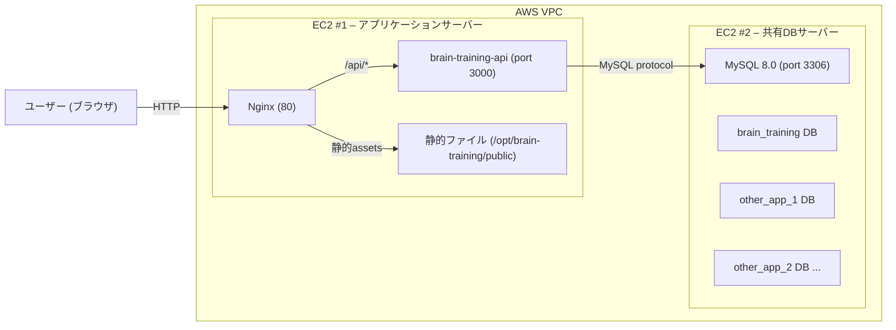

# 脳トレマニア EC2 デプロイ手順書

## アーキテクチャ概要



| コンポーネント | EC2 #1 (App) | EC2 #2 (共有DB) |
|---|---|---|
| OS | Amazon Linux 2023 | Amazon Linux 2023 |
| 推奨インスタンス | t3.small | t3.small 以上 |
| ストレージ | 20 GB gp3 | 30 GB gp3 (増設可) |
| ポート (外部公開) | 80, 22 | 22 のみ |
| ポート (VPC内) | — | 3306 |

> [!NOTE]
> ドメイン未取得のため、現時点では HTTP (port 80) + Elastic IP でのアクセス。
> ドメイン取得後に Let's Encrypt で HTTPS 化する手順を末尾に記載。

---

## Phase 1: AWS リソースの準備

### 1-1. VPC & サブネット

既存のデフォルト VPC を使用。2台の EC2 は **同一 VPC 内** に配置する。

### 1-2. セキュリティグループの作成

#### SG-App (アプリケーション用)

| タイプ | ポート | ソース | 用途 |
|---|---|---|---|
| SSH | 22 | 自分のIP | SSH接続 |
| HTTP | 80 | 0.0.0.0/0 | Web アクセス |
| HTTPS | 443 | 0.0.0.0/0 | Web アクセス (SSL) |

#### SG-DB (共有データベース用)

| タイプ | ポート | ソース | 用途 |
|---|---|---|---|
| SSH | 22 | 自分のIP | SSH接続 |
| MySQL | 3306 | **VPC CIDR (例: 10.0.0.0/16)** | VPC内の全アプリサーバーから接続 |

> [!IMPORTANT]
> DB の 3306 ポートは **VPC CIDR 全体** から許可する。
> こうすることで、今後追加する別アプリの EC2 からも接続できる。
> インターネット (0.0.0.0/0) には**絶対に公開しない**。

### 1-3. EC2 インスタンスの起動

1. **EC2 #1 (App)**: Amazon Linux 2023, t3.small, SG-App, **Elastic IP を割り当てる**
2. **EC2 #2 (DB)**: Amazon Linux 2023, t3.small, SG-DB, **Elastic IP は不要** (プライベートIPを使用)

キーペアは共通のものでOK。

---

## Phase 2: 共有 DB サーバー (EC2 #2) のセットアップ

```bash
ssh -i ~/.ssh/your-key.pem ec2-user@<DB_PUBLIC_IP>
```

### 2-1. MySQL 8.0 のインストール

```bash
# MySQL Community リポジトリの追加
sudo rpm --import https://repo.mysql.com/RPM-GPG-KEY-mysql-2023
sudo dnf install -y https://dev.mysql.com/get/mysql80-community-release-el9-5.noarch.rpm
sudo dnf install -y mysql-community-server
```

### 2-2. MySQL の起動 & 自動起動

```bash
sudo systemctl start mysqld
sudo systemctl enable mysqld
```

### 2-3. 初期パスワードの変更 & セキュリティ設定

```bash
# 初期パスワードの取得
sudo grep 'temporary password' /var/log/mysqld.log

# セキュリティ設定
sudo mysql_secure_installation
```

### 2-4. 外部接続を許可する設定

```bash
sudo vi /etc/my.cnf
```

`[mysqld]` セクションに以下を追加:

```ini
[mysqld]
bind-address = 0.0.0.0

# 共有DBサーバーとしてのチューニング
max_connections = 100
innodb_buffer_pool_size = 256M
character-set-server = utf8mb4
collation-server = utf8mb4_unicode_ci
```

```bash
sudo systemctl restart mysqld
```

### 2-5. 脳トレマニア用のDB & ユーザー作成

```bash
sudo mysql -u root -p
```

```sql
-- ===== 脳トレマニア用 =====
CREATE DATABASE brain_training
  CHARACTER SET utf8mb4
  COLLATE utf8mb4_unicode_ci;

-- アプリ用ユーザー (VPC内の任意のIPから接続可能)
CREATE USER 'brain_app'@'%' IDENTIFIED BY 'BrainStr0ng!Pass#2026';
GRANT ALL PRIVILEGES ON brain_training.* TO 'brain_app'@'%';

-- ===== 将来の別アプリ用 (テンプレート) =====
-- CREATE DATABASE other_app CHARACTER SET utf8mb4 COLLATE utf8mb4_unicode_ci;
-- CREATE USER 'other_app_user'@'%' IDENTIFIED BY 'OtherStr0ng!Pass#2026';
-- GRANT ALL PRIVILEGES ON other_app.* TO 'other_app_user'@'%';

FLUSH PRIVILEGES;
```

> [!TIP]
> **共有DBサーバーの設計方針:**
> - アプリごとに **別のデータベース** と **別のユーザー** を作成する
> - 各ユーザーは自分のDBにのみ権限を持つ → アプリ間のデータ分離を確保
> - パスワードは `openssl rand -base64 24` で生成する

### 2-6. マイグレーションの実行

```bash
# ローカルPCから SQL ファイルを DB EC2 へ転送
scp -i ~/.ssh/your-key.pem \
  backend/migrations/001_init.sql \
  backend/migrations/002_add_is_crown.sql \
  backend/migrations/003_add_display_name.sql \
  ec2-user@<DB_PUBLIC_IP>:/tmp/

# DB EC2 上で実行
mysql -u brain_app -p brain_training < /tmp/001_init.sql
mysql -u brain_app -p brain_training < /tmp/002_add_is_crown.sql
mysql -u brain_app -p brain_training < /tmp/003_add_display_name.sql
```

> [!NOTE]
> Rust アプリ (`main.rs`) が起動時にマイグレーションを自動実行するため、
> この手順はスキップしても Phase 3 完了後の初回起動で自動適用される。

### 2-7. 接続テスト (App EC2 から)

```bash
# EC2 #1 (App) に SSH して確認
ssh -i ~/.ssh/your-key.pem ec2-user@<APP_PUBLIC_IP>

# MySQL クライアントで接続テスト
sudo dnf install -y mysql
mysql -h <DB_PRIVATE_IP> -u brain_app -p brain_training -e "SELECT 1;"
```

---

## Phase 3: App サーバー (EC2 #1) のセットアップ

```bash
ssh -i ~/.ssh/your-key.pem ec2-user@<APP_PUBLIC_IP>
```

### 3-1. 必要なパッケージのインストール

```bash
sudo dnf update -y
sudo dnf install -y nginx git gcc openssl-devel
```

### 3-2. Rust のインストール & バイナリのビルド

```bash
# Rust インストール
curl --proto '=https' --tlsv1.2 -sSf https://sh.rustup.rs | sh -s -- -y
source $HOME/.cargo/env

# ソースコードの取得
git clone <YOUR_REPO_URL> /tmp/brain-training-src
cd /tmp/brain-training-src/backend

# リリースビルド
cargo build --release

# バイナリの配置
sudo mkdir -p /opt/brain-training
sudo cp target/release/brain-training-api /opt/brain-training/
sudo chmod +x /opt/brain-training/brain-training-api
```

> [!TIP]
> 2回目以降の更新では `git pull && cargo build --release` → バイナリコピー → `sudo systemctl restart brain-training` だけでOK。

### 3-3. フロントエンド静的ファイルのデプロイ

ローカル PC から転送:

```bash
# ローカルで実行
rsync -avz \
  --exclude='backend' \
  --exclude='.git' \
  --exclude='.github' \
  --exclude='.agents' \
  --exclude='.claude' \
  --exclude='node_modules' \
  --exclude='*.md' \
  --exclude='image.png' \
  -e "ssh -i ~/.ssh/your-key.pem" \
  /Users/nt718/learning/mental-training/ \
  ec2-user@<APP_PUBLIC_IP>:/tmp/brain-training-public/
```

```bash
# EC2 #1 上で配置
sudo mkdir -p /opt/brain-training/public
sudo cp -r /tmp/brain-training-public/* /opt/brain-training/public/
sudo chown -R ec2-user:ec2-user /opt/brain-training/
```

最終ディレクトリ構成:

```
/opt/brain-training/
├── brain-training-api          # Rust バイナリ
└── public/
    ├── index.html
    ├── manifest.json
    ├── sw.js
    ├── favicon.png
    ├── icon-192.png
    ├── icon-512.png
    ├── css/
    ├── js/
    └── assets/
```

### 3-4. systemd サービスの登録

まず JWT_SECRET を生成:

```bash
openssl rand -hex 32
# 出力された文字列をメモする
```

サービスファイルの作成:

```bash
sudo tee /etc/systemd/system/brain-training.service << 'EOF'
[Unit]
Description=Brain Training API Server
After=network.target

[Service]
Type=simple
User=ec2-user
WorkingDirectory=/opt/brain-training
ExecStart=/opt/brain-training/brain-training-api
Restart=always
RestartSec=5

# --- 環境変数 (★ 値を書き換えること) ---
Environment=DATABASE_URL=mysql://brain_app:BrainStr0ng!Pass#2026@<DB_PRIVATE_IP>:3306/brain_training
Environment=JWT_SECRET=ここにopenssl-rand-hex-32の出力を貼る
Environment=GOOGLE_CLIENT_ID=340799933913-4o1th83hoo01qcn1lrcgtc6ovgmnklo0.apps.googleusercontent.com
Environment=PORT=3000
Environment=RUST_LOG=info
Environment=STATIC_DIR=/opt/brain-training/public

[Install]
WantedBy=multi-user.target
EOF
```

> [!WARNING]
> 以下の値を必ず書き換えること:
> - `<DB_PRIVATE_IP>` → EC2 #2 のプライベートIP (例: `172.31.xx.xx`)
> - `BrainStr0ng!Pass#2026` → Phase 2-5 で設定した実際のパスワード
> - `JWT_SECRET` → `openssl rand -hex 32` の出力

```bash
sudo systemctl daemon-reload
sudo systemctl enable brain-training
sudo systemctl start brain-training

# 動作確認
sudo systemctl status brain-training
curl http://localhost:3000/api/auth/config
```

### 3-5. Nginx の設定

```bash
sudo tee /etc/nginx/conf.d/brain-training.conf << 'EOF'
server {
    listen 80;
    server_name _;

    # Static files
    root /opt/brain-training/public;
    index index.html;

    # Cache static assets
    location ~* \.(js|css|png|jpg|svg|ico|woff2|webp)$ {
        expires 7d;
        add_header Cache-Control "public, immutable";
    }

    # API proxy to Rust backend
    location /api/ {
        proxy_pass http://127.0.0.1:3000;
        proxy_http_version 1.1;
        proxy_set_header Host $host;
        proxy_set_header X-Real-IP $remote_addr;
        proxy_set_header X-Forwarded-For $proxy_add_x_forwarded_for;
        proxy_set_header X-Forwarded-Proto $scheme;
    }

    # SPA fallback
    location / {
        try_files $uri $uri/ /index.html;
    }
}
EOF
```

```bash
# デフォルト設定を無効化
sudo rm -f /etc/nginx/conf.d/default.conf

# 設定テスト & 起動
sudo nginx -t
sudo systemctl enable nginx
sudo systemctl start nginx
```

---

## Phase 4: Google OAuth の設定

### IP 直アクセスの場合の注意点

> [!CAUTION]
> Google Sign-In は原則 **HTTPS** を要求する。
> `http://<Elastic IP>` での Google OAuth は **動作しない可能性が高い**。
>
> 対策 (いずれかを選択):
> 1. **ドメインを取得して HTTPS 化** (推奨) → 末尾の「HTTPS 化手順」参照
> 2. **暫定:** テスト中は localhost で開発し、本番公開時にドメインを用意する
> 3. **代替:** Google OAuth を一時的にオフにし、匿名利用のみ対応する

ドメイン取得後に [Google Cloud Console](https://console.cloud.google.com/apis/credentials) で以下を更新:

| 設定項目 | 値 |
|---|---|
| Authorized JavaScript origins | `https://notore-mania.com` |
| Authorized redirect URIs | `https://notore-mania.com` |

---

## Phase 5: 動作確認チェックリスト

```bash
# Elastic IP でアクセス
open http://<APP_ELASTIC_IP>
```

- [ ] フロントエンド (index.html) が表示される
- [ ] PWA マニフェスト (`/manifest.json`) が配信される
- [ ] API レスポンス (`/api/auth/config`) が返る
- [ ] ゲームが正常にプレイできる (ローカルスコア保存)
- [ ] DB 接続ログに `Connected to MySQL` が出ている

---

## 運用コマンド集

### ログ確認

```bash
# Rust API
sudo journalctl -u brain-training -f

# Nginx
sudo tail -f /var/log/nginx/access.log
sudo tail -f /var/log/nginx/error.log
```

### アプリ更新デプロイ

```bash
# EC2 #1 上で
cd /tmp/brain-training-src
git pull
cd backend
cargo build --release
sudo cp target/release/brain-training-api /opt/brain-training/
sudo systemctl restart brain-training
```

### フロントエンド更新

```bash
# ローカルから再度 rsync で転送
rsync -avz \
  --exclude='backend' --exclude='.git' --exclude='.github' \
  --exclude='.agents' --exclude='.claude' --exclude='node_modules' \
  --exclude='*.md' --exclude='image.png' \
  -e "ssh -i ~/.ssh/your-key.pem" \
  /Users/nt718/learning/mental-training/ \
  ec2-user@<APP_PUBLIC_IP>:/opt/brain-training/public/
```

### DB バックアップ (EC2 #2)

```bash
# 手動バックアップ
mysqldump -u root -p brain_training > ~/backups/brain_training_$(date +%Y%m%d).sql

# 自動バックアップ (cron)
echo '0 3 * * * mysqldump -u root -pYOUR_PASSWORD brain_training > ~/backups/brain_training_$(date +\%Y\%m\%d).sql' | crontab -
```

### 別アプリの追加 (将来)

DB EC2 で以下を実行するだけ:

```sql
CREATE DATABASE new_app CHARACTER SET utf8mb4 COLLATE utf8mb4_unicode_ci;
CREATE USER 'new_app_user'@'%' IDENTIFIED BY 'NewStr0ng!Pass#2026';
GRANT ALL PRIVILEGES ON new_app.* TO 'new_app_user'@'%';
FLUSH PRIVILEGES;
```

---

## ドメイン・HTTPS 化の手順

ドメイン (`notore-mania.com`) が有効になった後の HTTPS 化手順:

### 1. DNS 設定

ドメインの A レコードを EC2 #1 の Elastic IP に向ける。

### 2. Nginx の server_name を更新

```bash
sudo sed -i 's/server_name _;/server_name notore-mania.com;/' /etc/nginx/conf.d/brain-training.conf
sudo systemctl reload nginx
```

### 3. Let's Encrypt で SSL 証明書を取得

```bash
sudo dnf install -y certbot python3-certbot-nginx
sudo certbot --nginx -d notore-mania.com
sudo systemctl enable certbot-renew.timer
```

### 4. Google OAuth の origins を更新

Google Cloud Console で `https://notore-mania.com` を追加。

---

## コスト概算 (東京リージョン)

| 項目 | 月額概算 |
|---|---|
| EC2 t3.small × 2 | ~$30 |
| EBS 20GB + 30GB (gp3) | ~$5 |
| Elastic IP × 1 | $0 (稼働中) |
| データ転送 | ~$1 |
| **合計** | **~$36/月** |

> [!TIP]
> - **t3.micro** (無料枠対象) なら 12ヶ月間は EC2 無料
> - DB の EBS は将来アプリが増えたら gp3 を拡張可能
> - Reserved Instances (1年) で最大 40% 節約可能
